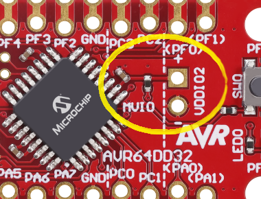
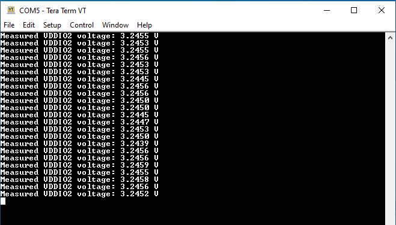

<!-- Please do not change this html logo with link -->

# Multi-Voltage Input/Output (MVIO) in Three Different Examples Using the AVR64DD32 Microcontroller

 The repository contains three MPLAB® X projects:

1.  [MVIO 1 Logic](#1-mvio-1-logic) – This use case shows how to configure two output pins that provide different output voltage levels: 3.3V for a non-MVIO pin and 5V for a MVIO pin.
2.  [MVIO Interrupt](#2-mvio-interrupt) – This use case shows how to configure the MVIO interrupt and how turn on the on-board LED when the voltage drops below the acceptable threshold.
3.  [MVIO Read Voltage](#3-mvio-read-voltage) – This use case shows how to read the voltage on VDDIO2 with the Analog-to-Digital (ADC), and then send it through the Universal Synchronous and Asynchronous Receiver and Transmitter (USART).

## Related Documentation

More details and code examples on the AVR64DD32 can be found at the following links:

- [AVR64DD32 Product Page](https://www.microchip.com/wwwproducts/en/AVR64DD32)
- [AVR64DD32 Code Examples on GitHub](https://github.com/microchip-pic-avr-examples?q=AVR64DD32)
- [AVR64DD32 Project Examples in START](https://start.atmel.com/#examples/AVR64DD32CuriosityNano)

## Software Used

- [MPLAB® X IDE](http://www.microchip.com/mplab/mplab-x-ide) v6.00 or newer
- [MPLAB® XC8](http://www.microchip.com/mplab/compilers) v2.36 or newer
- [AVR-Dx Series Device Pack](https://packs.download.microchip.com/) v2.1.152 or newer

## Hardware Used

- The AVR64DD32 Curiosity Nano Development Board is used as a test platform
   

## Prerequisites

In case the Curiosity Nano board is used for these examples, for the MVIO to work, disconnect the R201 resistor and connect VDDIO2 to VCC_TARGET.

A power supply must be connected to the VDDIO2 pin. There are two possible use cases:
 
**a.** Connecting an external DC power supply to the VDDIO2 pin and GND.
 
**b.** When using the Curiosity Nano, use VBUS as a power supply, simply by connecting a wire between VBUS and VDDIO2.

## Operation

To program the Curiosity Nano board with this MPLAB® X project, follow the steps provided in the [How to Program the Curiosity Nano Board](#how-to-program-the-curiosity-nano-board) chapter.  

## 1. MVIO 1 Logic

This program demonstrates the functionality of the MVIO pins of the AVR® DD microcontrollers. It configures two outputs pins as HIGH (logic `1`); one is an MVIO pin and the other one is a non-MVIO. 

**Note**: VDDIO2 is connected to tthe VBUS on the AVR DD Curiosity Nano board.

By using a voltmeter, it can be observed that the microcontroller is generating 3.3V on the non-MVIO pin and 5V on the MVIO pin. 

This simple example uses the pins as GPIO pins, but other peripherals (such as I2C, SPI, USART, Timers and so on) would also have different voltage values for logic `1`, on MVIO and non-MVIO pins. 

This adds a lot of flexibility to the AVR® DD family, allowing the devices to communicate with sensors/MPUs/SoCs at different operating levels, without needing external components such as level shifters.

### 1.1 Setup

The following configurations must be made for this project:

* System clock is 4 MHz

* SYSCFG0 fuse set to no CRC and SYSCFG1 fuse is set to have a dual-supply MVIO

* Non-MVIO PA3 pin is set to output

* MVIO PC3 pin is set to output

<Pins>

|Pin                       | Configuration      |
|   ---------------------  |   ---------------- |
| PA3 - non-MVIO           | Digital output     |
| PC3 - MVIO               | Digital output     |

### 1.2 Demo

 

This gif shows the output voltage levels on the non-MVIO pin (3.3V) and on the MVIO pin (5V).

### 1.3 Summary

This program demonstrates the difference between the MVIO and non-MVIO pins, both set as output, the first one having a 5V output level and the second one a 3.3V output level.  
[Back to top](#multi-voltage-inputoutput-mvio-in-three-different-examples-using-the-avr64dd32-microcontroller) 

## 2. MVIO Interrupt

This program demonstrates the functionality of the MVIO status interrupt. 

**Note**: VDDIO2 is connected to an external and adjustable power supply.

When the VDDIO2 voltage level falls below the acceptable threshold (of about 1.6V), the status bit changes and an interrupt is issued. When the VDDIO2 voltage increases above the threshold, the status bit will change again, issuing another interrupt.

**Note**: The interrupt flag must be cleared in code.

For this example, the on-board LED is turned on as long as the voltage is below the threshold and turned off when the VDDIO2 is above the threshold. 

### 2.1 Setup

The following configurations must be made for this project:

- System clock is 4 MHz

- SYSCFG0 fuse is set to no CRC and the SYSCFG1 fuse is set to have a dual-supply MVIO

- Global interrupts and the MVIO interrupt are enabled

- LED pin is set to output (PF5)

<Pins>

|Pin                       | Configuration      |
| :---------------------:  | :----------------: |
| PF5 (LED pin)            | Digital output     |

### 2.2 Demo

 

  This gif shows what happens when the VDDIO2 voltage drops bellow the threshold. In this example, a wire is placed between the VDDIO2 and the VBUS, that is used as a power supply (5V) – the LED is turned off. The wire is then unplugged (0V) – the LED is turned on.

### 2.3 Summary

This program demonstrates the use of the MVIO interrupt to turn on an LED when the voltage applied to MVIO is too low.   
[Back to top](#multi-voltage-inputoutput-mvio-in-three-different-examples-using-the-avr64dd32-microcontroller) 

## 3. MVIO Read Voltage

This program reads the voltage on VDDIO2 using an internal ADC channel which is connected to it. 

It is possible that the ADC operates at a voltage lower than the MVIO. To be able to handle such cases, the ADC channel connected to MVIO provides the VDDIO2 voltage divided by 10. This means that the ADC measures a voltage ten times smaller than the actual voltage, this way it can safely handle the case when VDDIO2 is greater than VDD.

**Note**: A power supply must be connected to the VDDIO2 pin. There are two possible use cases:
 
**a.** Connecting an external DC power supply to the VDDIO2 pin and to GND.
 
**b.** When using the Curiosity Nano, use VBUS as a power supply, simply by connecting a wire between VBUS and VDDIO2. 

The program then converts the reading into the actual voltage and sends it through USART, every 500 ms.

### 3.1 Setup

The following configurations must be made for this project:

- System clock is 4 MHz

- SYSCFG0 fuse is set to no CRC and SYSCFG1 fuse is set to have a dual-supply MVIO

- ADC is configured for 1.024 reference, with left-adjusted results and 16 samples

- USART is configured for 115200 baud, 8N1 format, with transmit enabled and printf stream

- Pin PD4 for USART0 TX is configured as output

|Pin                       | Configuration      |
| :---------------------:  | :----------------: |
| PD4 (USART0 TX)          | Digital output     |

### 3.2 Demo

The image below shows the messages received from the board during a normal operation.
  

### 3.3 Summary

This program shows how to read the value of the voltage on VDDIO2 and send the information through USART.   
[Back to top](#multi-voltage-inputoutput-mvio-in-three-different-examples-using-the-avr64dd32-microcontroller) 

## How to Program the Curiosity Nano Board

This chapter shows how to use the MPLAB® X IDE to program an AVR® device with an Example_Project.X. This can be applied to any other projects.

- Connect the board to the PC

- Open the Example_Project.X project in MPLAB® X IDE

- Set the Example_Project.X project as main project

  - Right click the project in the **Projects** tab and click **Set as Main Project**
     

- Clean and build the Example_Project.X project

  - Right click the **Example_Project.X** project and select **Clean and Build**
     

- Select **AVRxxxxx Curiosity Nano** in the Connected Hardware Tool section of the project settings:

  - Right click the project and click **Properties**
  - Click the arrow under the Connected Hardware Tool
  - Select **AVRxxxxx Curiosity Nano** (click the **SN**), click **Apply** and then click **OK**:
     

- Program the project to the board
  - Right click the project and click **Make and Program Device**
     

 

- [Back to 1. MVIO 1 Logic](#1-mvio-1-logic)
- [Back to 2. MVIO Interrupt](#2-mvio-interrupt)
- [Back to 3. MVIO Read Voltage](#3-mvio-read-voltage)
- [Back to top](#multi-voltage-inputoutput-mvio-in-three-different-examples-using-the-avr64dd32-microcontroller) 
